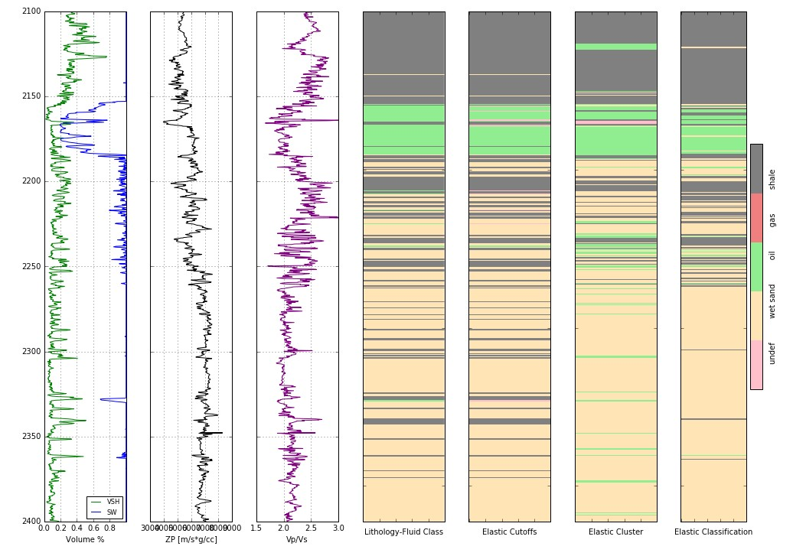

# Rock Prediction

## See Log_Work.ipynb for documented code with explanation

### Classification of Log Data
### Facies Classification Example

Here we'll look to

Classify well curves
Compute elastic properties
Cross plot
Identify trends and clusters
Classify based on elastic properties

